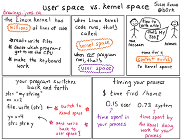

What is the difference between the **kernel space** and the **user space**?

%

A modern computer operating system usually segregates virtual memory into kernel space and user space. Primarily, this separation serves to provide memory protection and hardware protection from malicious or errant software behaviour.
#### Kernel Space 
Kernel space is strictly reserved for running a privileged operating system kernel, kernel extensions, and most device drivers. 
#### User Space 
In contrast, user space is the memory area where application software and some drivers execute.

---

